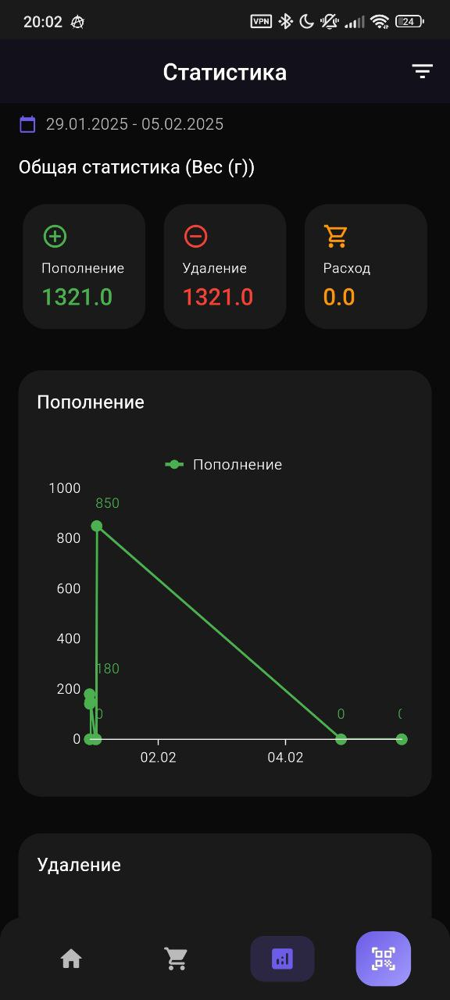

Профиль «Информационные технологии»
Командный кейс №2 «SmartFridge: QR Control & IoT Sync»

# 🧊 Freaky Fridge

Freaky Fridge - это современное мобильное приложение для умного управления содержимым вашего холодильника. Приложение помогает отслеживать сроки годности продуктов, планировать покупки и минимизировать пищевые отходы.

## ✨ Основные возможности

- 📝 Учет продуктов в холодильнике
- ⏰ Отслеживание сроков годности
- 🔔 Уведомления о скором истечении срока годности
- 📊 Статистика использования продуктов
- 🛒 Список покупок
- 📱 Удобный и современный интерфейс
- 📷 Сканирование QR-кодов для быстрого добавления продуктов
- 🗂 Категоризация продуктов
- 📊 Аналитика и отчеты

## 🏗 Архитектура проекта

### Технологический стек

#### Frontend
- **Flutter** - основной фреймворк для разработки кроссплатформенного приложения
- **GetX** - для управления состоянием и навигацией
  - Реактивное управление состоянием
  - Dependency injection
  - Роутинг и навигация
- **Drift (SQLite)** - для локального хранения данных
- **Flutter Local Notifications** - система уведомлений
- **QR Flutter & Mobile Scanner** - работа с QR-кодами
- **Syncfusion Charts** - визуализация данных и аналитика
- **Share Plus** - нативный шеринг
- **Image Picker** - работа с изображениями
- **Intl** - интернационализация

#### Паттерны проектирования
- **MVC (Model-View-Controller)** - основная архитектура приложения
- **Repository Pattern** - для работы с данными
- **Dependency Injection** - через GetX

### Структура базы данных

#### Таблица Category

| Поле | Тип | Описание | Ограничения |
|------|-----|----------|-------------|
| id | INTEGER | Уникальный идентификатор | PRIMARY KEY, AUTOINCREMENT |
| name | TEXT | Название категории | NOT NULL |
| color | INTEGER | Цвет категории | DEFAULT 0xFF9C27B0 |

#### Таблица Product

| Поле | Тип | Описание | Ограничения |
|------|-----|----------|-------------|
| id | INTEGER | Уникальный идентификатор | PRIMARY KEY, AUTOINCREMENT |
| name | TEXT | Название продукта | NOT NULL |
| productType | INTEGER | Тип продукта | FOREIGN KEY → Category(id) |
| manufactureDate | DATETIME | Дата производства | NOT NULL |
| expirationDate | DATETIME | Срок годности | NOT NULL |
| massVolume | REAL | Масса/объем | NOT NULL |
| unit | INTEGER | Единица измерения (enum) | NOT NULL |
| nutritionFacts | TEXT | Пищевая ценность | NOT NULL |
| allergens | TEXT | Аллергены (JSON массив) | DEFAULT '[]' |

#### Таблица ProductTransaction

| Поле | Тип | Описание | Ограничения |
|------|-----|----------|-------------|
| id | INTEGER | Уникальный идентификатор | PRIMARY KEY, AUTOINCREMENT |
| productName | TEXT | Название продукта | NOT NULL |
| categoryName | TEXT | Название категории | NOT NULL |
| transactionDate | DATETIME | Дата транзакции | NOT NULL |
| quantity | REAL | Количество | NOT NULL |
| unit | INTEGER | Единица измерения | NOT NULL |
| normalizedQuantity | REAL | Нормализованное количество | NOT NULL |
| type | TEXT | Тип транзакции (enum) | NOT NULL |
| productId | INTEGER | ID продукта | FOREIGN KEY → Product(id), NULL |

#### Таблица WishListItem

| Поле | Тип | Описание | Ограничения |
|------|-----|----------|-------------|
| id | INTEGER | Уникальный идентификатор | PRIMARY KEY, AUTOINCREMENT |
| productName | TEXT | Название продукта | NOT NULL |
| quantity | INTEGER | Количество | NOT NULL |
| isChecked | BOOLEAN | Статус покупки | DEFAULT FALSE |

### Enum'ы

#### Unit (Единицы измерения)
- grams (граммы)
- kilograms (килограммы)
- milliliters (миллилитры)
- liters (литры)
- pieces (штуки)

#### TransactionType (Типы транзакций)
- replenishment (пополнение)
- expense (расход)
- deletion (удаление)

### Индексы
- `idx_products_expiration` на `products(expiration_date)`
- `idx_products_category` на `products(category_id)`
- `idx_history_product` на `product_history(product_id)`

## 🚀 Установка и развертывание

### Требования к системе
- Flutter SDK
- Dart SDK
- Android SDK для Android сборки
- Минимум 2GB RAM
- 500MB свободного места

### Шаги установки
### Через RuStore:

[Ссылка на RuStore](https://www.rustore.ru/catalog/app/com.freaky_incorporated.freaky_fridge)


### Через консоль:
1. Клонирование репозитория:
```bash
git clone https://github.com/batsura-vs/freaky_fridge.git
cd freaky_fridge
```

2. Установка зависимостей:
```bash
flutter pub get
```

3. Генерация кода Drift:
```bash
flutter pub run build_runner build
```

4. Запуск приложения:
```bash
flutter run
```

### Конфигурация
- Основная конфигурация базы данных в `lib/database/database.dart`
- Сгенерированные файлы базы данных в `lib/database/database.g.dart`

## 📱 Скриншоты приложения

### Основной функционал


### QR-код и сканирование


### Статистика и планирование



## 📞 Контакты

Если у вас есть вопросы или предложения, пожалуйста, создайте Issue в репозитории проекта.

---

Сделано с ❤️ для удобного управления продуктами

